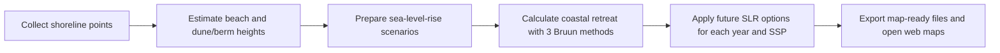
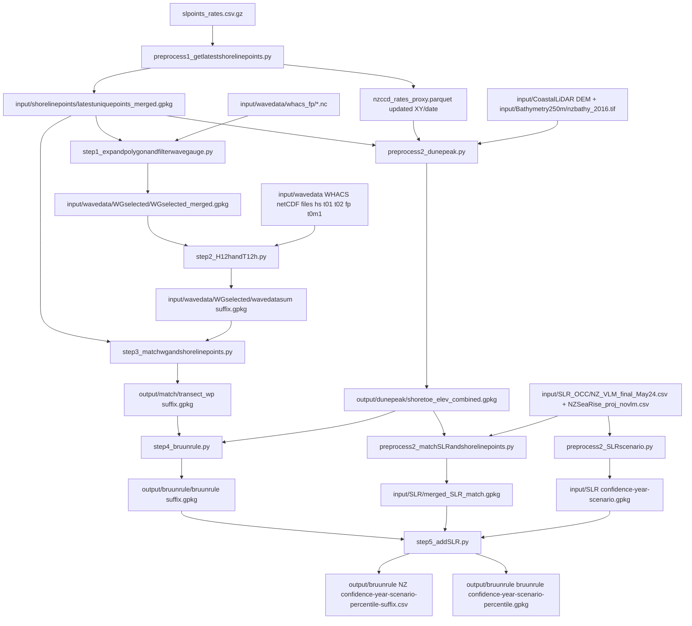
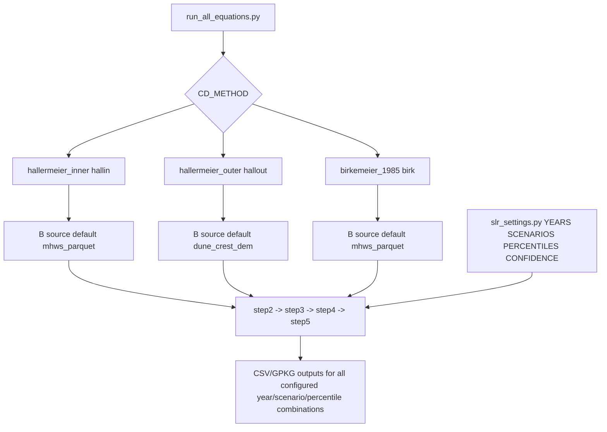

# Bruun-rule-yaxiong

End-to-end workflow for NZCCD shoreline projection using:

- WHACS wave hindcast time series
- Bruun-rule retreat equations
- OCC SLR scenarios
- Transect-based shoreline geometry from NZCCD

This README describes the current code behavior (inputs, calculations, outputs, and where to configure options).

## View Latest Maps

- Main map (latest public): https://rnc-research-group.github.io/Bruun-rule-yaxiong/
- Equation comparison map (2100 / SSP4.5): https://rnc-research-group.github.io/Bruun-rule-yaxiong/compare_2100_45_three_equations.html

## Quick Start (Non-Technical)

If you only need the big picture, this is the workflow:



Plain-language summary:

- The model starts from the latest measured shoreline positions and rates.
- It estimates key coastal profile heights (berm and dune-related inputs).
- It combines those with wave climate and three Bruun equation options.
- It then applies SLR choices (years, SSPs, confidence/percentiles).
- Final outputs are CSV/GPKG files used in maps and analysis.

## 1) High-Level Pipeline

1. Build latest shoreline points and transect direction vectors.
2. Build dune/berm elevation attributes used as Bruun `B`.
3. Build SLR scenario layers and match shoreline points to SLR site IDs.
4. Select wave gauges near shoreline and compute wave summary + depth of closure (`CD`).
5. Match wave gauges to shoreline points and run Bruun retreat.
6. Apply SLR scenarios to Bruun retreat and export map-ready CSV/GPKG outputs.

## 1A) Flow Charts

### Script + Data Handoff



### Equation + SLR Branching



## 2) Input Files and Where They Are Used

### Shoreline/rates data roles (quick reference)

| File | Record structure | Coordinate meaning | Primary use in workflow |
|---|---|---|---|
| `slpoints_rates.csv.gz` | Multiple rows per `Unique_ID` (shoreline-transect intersection history with rates and dates) | Latest XY per transect = current shoreline position | Build `latestuniquepoints_merged.gpkg`; provide current shoreline start point for dune-crest profile sampling |
| `nzccd_rates_proxy.parquet` | One row per transect (`UniqueID`) with transect-level attributes and proxy geometry | XY = MHWS proxy location for the transect | Sample DEM at MHWS proxy to produce `B_mhws_elev_m` (berm proxy) for `mhws_parquet` Bruun runs |

### Core shoreline/rates inputs

- `slpoints_rates.csv.gz`
  - Used by: `preprocess1_getlatestshorelinepoints.py`
  - Content: many shoreline-transect intersection points per `Unique_ID` (time/history rows), including rates-of-change and date fields (`WLR`, `NSM`, `Duration`, `Date`, `Start_date`, `End_date`, etc.).
  - How coordinates are used: the latest point coordinate per transect is selected as the current shoreline position; that XY is the starting point for landward profile sampling used to find dune crest elevation.

- `nzccd_rates_proxy.parquet`
  - Updated by: `preprocess1_getlatestshorelinepoints.py`
  - Content: one proxy record per transect (`UniqueID`) with transect-level attributes (including rates-related fields) and shoreline-proxy geometry.
  - How coordinates are used: proxy XY represents MHWS location for that transect, and DEM sampled at this location becomes `B_mhws_elev_m` (berm proxy).
  - Bruun usage: this feeds the `mhws_parquet` B-source path (berm/MHWS-based runs; default for `hallermeier_inner` and `birkemeier_1985` in current settings).

- `input/shorelinepoints/latestuniquepoints_merged.gpkg`
  - Produced by: `preprocess1_getlatestshorelinepoints.py`
  - Used by: `preprocess2_dunepeak.py`, `step1_expandpolygonandfilterwavegauge.py`, `step3_matchwgandshorelinepoints.py`.

### DEM/elevation inputs

- `input/CoastalLiDAR/*1m*.tif` (preferred) or `input/CoastalLiDAR/NewZealand_Coastal_DEM_Merged_250m.tif`
  - Used by: `preprocess2_dunepeak.py`
  - Purpose: dune-crest extraction and MHWS elevation sampling.
  - Typical source context: 2016 coastal LiDAR DEM products (project-specific preprocessing may be required before use in this repo).
  - Reference links:
    - LINZ Data Service (LDS): https://data.linz.govt.nz/
    - LINZ elevation and LiDAR guidance: https://www.linz.govt.nz/products-services/data/types-linz-data/elevation-data

- `input/Bathymetry250m/nzbathy_2016.tif`
  - Used by: `preprocess2_dunepeak.py`, `step4_bruunrule.py`
  - Purpose: shoreline elevation sampling and closure-depth transect intersection.
  - Typical source context: NZ national bathymetry grid products used for closure-depth transect profiling.
  - Reference links:
    - LINZ Data Service (LDS): https://data.linz.govt.nz/
    - LINZ seabed/bathymetry overview: https://www.linz.govt.nz/products-services/data/types-linz-data/hydrographic-data

### Wave inputs

- `input/wavedata/whacs_{hs,t01,t02,fp,t0m1}/*.nc`
  - Used by: `step2_H12handT12h.py`
  - Purpose: long-term wave time series for `Hs_12h_y`, `T*`, and CD computations.
  - Source context: WHACS hindcast time series netCDF files.
  - Reference links:
    - WHACS data portal (AIMS): https://wave.storm-surge.cloud.edu.au/
    - Example endpoint pattern used by this project scripts: https://wave.storm-surge.cloud.edu.au/WHACS/

- `input/wavedata/whacs_fp/fp_WHACS_hindcast_WHACS_ERA5_1hr_197901010000-197901312300.nc`
  - Used by: `step1_expandpolygonandfilterwavegauge.py`
  - Purpose: wave gauge locations (`seapoint`, lon/lat).

### Data source notes

- This repository expects local copies of DEM, bathymetry, and WHACS files under the paths above.
- Public portals can update file naming and coverage over time; keep local filenames aligned with what scripts currently expect.
- If you swap in a new DEM/bathymetry file, verify CRS consistency before rerunning the pipeline.

### SLR/OCC inputs

- `input/SLR_OCC/NZ_VLM_final_May24.csv`
  - Used by: `preprocess2_SLRscenario.py`, `preprocess2_matchSLRandshorelinepoints.py`
  - Purpose: SLR site IDs and coordinates.

- `input/SLR_OCC/NZSeaRise_proj_novlm.csv`
  - Used by: `preprocess2_SLRscenario.py`, `preprocess2_matchSLRandshorelinepoints.py`
  - Purpose: NZSeaRise/OCC projection values by `year/scenario/confidence/percentile`.
  - Local file in repo: [NZSeaRise_proj_novlm.csv](NZSeaRise_proj_novlm.csv)
  - Project/data links:
    - NZ SeaRise project: https://www.searise.nz/
    - SLR projections context (OCC-linked workflow in this repo): [preprocess2_SLRscenario.py](preprocess2_SLRscenario.py)

## 3) Detailed Step-by-Step Flow

### A. Shoreline point preparation

`preprocess1_getlatestshorelinepoints.py`

- Reads `slpoints_rates.csv.gz`.
- Validates required columns.
- Keeps latest row per `Unique_ID` by date.
- Interprets `slpoints_rates.csv.gz` as shoreline-transect intersection history (multiple rows per transect with rates/date fields).
- Uses the latest XY per transect as the current shoreline coordinate.
- Computes transect unit direction vectors (`ux1`, `uy1`) using landward vs seaward distance ordering.
- Writes `input/shorelinepoints/latestuniquepoints_merged.gpkg`.
- Updates `nzccd_rates_proxy.parquet` (one proxy row per transect) with latest shoreline XY/date for consistent downstream ID alignment.

### B. Dune and berm elevation derivation

`preprocess2_dunepeak.py`

This step computes both elevation families so downstream equations can choose either source.

1. Segment continuity:
- Splits shoreline into contiguous segments.
- Uses `MAX_POINT_GAP_M=10` m so orientation is not bridged across large gaps.

2. Local shoreline orientation and landward direction:
- Builds tangent from neighbor points.
- Builds left/right normals.
- Probes each side (`ORIENT_PROBE_MAX_M=25`, `ORIENT_PROBE_STEP_M=2`) to identify seaward side by lower mean elevation.
- Chooses opposite normal as landward profile direction.

3. Dune crest profile extraction:
- Samples DEM profile from `PROFILE_START_M=2` to `PROFILE_MAX_M=80` at `1 m` spacing.
- Smooths with moving average (`SMOOTH_WINDOW=5`).
- Finds first valid local crest requiring:
  - minimum rise (`MIN_RISE_M=0.35`) above running minimum
  - local max/flat-top tolerance (`FLAT_TOL_M=0.03`)
  - no post-crest rise over next `POST_CREST_CHECK_POINTS=6` samples
- Uses average around peak (`CREST_AVG_SIDE_POINTS=5`) as stabilized dune elevation.

4. Additional sampled fields:
- `shoreline_elev_m`: value sampled at the current shoreline XY (latest point from `slpoints_rates.csv.gz`) from `nzbathy_2016.tif`.
- `B_mhws_elev_m`: coastal DEM value sampled at MHWS proxy XY (from `nzccd_rates_proxy.parquet`) and used as the berm proxy for `mhws_parquet` runs.

5. Output:
- `output/dunepeak/shoretoe_elev_combined.gpkg`
  - Includes `coast_elev_m`, `dune_crest_*`, `shoreline_elev_m`, `B_mhws_elev_m`, `mhws_x`, `mhws_y`.

### C. SLR scenario preparation and shoreline-SLR matching

`preprocess2_SLRscenario.py`

- Reads SLR settings from `slr_settings.py`.
- For each configured `year x scenario`, filters OCC projections by confidence.
- Writes `input/SLR/{confidence}_y_{year}_s_{scenario}.gpkg`.

`preprocess2_matchSLRandshorelinepoints.py`

- Loads shoreline/dunepeak points.
- Builds SLR site geometry from OCC files.
- Performs nearest spatial match from shoreline points to SLR sites.
- Writes shoreline with SLR site match fields to `input/SLR/merged_SLR_match.gpkg` (or compatible naming in workflow).

### D. Wave gauge selection and CD computation

`step1_expandpolygonandfilterwavegauge.py`

- Buffers shoreline points (`buffer_dist=14000 m`) and selects gauges inside buffered area.
- Writes selected gauges to `input/wavedata/WGselected/WGselected_merged.gpkg`.

`step2_H12handT12h.py`

- Uses wave records from 1979-01-01 to 2024-01-01.
- Computes annual 12-hour exceedance wave state:
  - exceedance probability = `12 / (24*365)`
  - obtains `Hs_12h_y`, period metrics, and `Tmean`.
- Computes `CD` with selected equation (see Section 4).
- Writes `wavedatasum_*_{suffix}.gpkg`.

### E. Wave-to-transect match and Bruun retreat

`step3_matchwgandshorelinepoints.py`

- Loads shoreline points and equation-specific wave summary.
- For each shoreline point, finds nearest wave gauges (`num_nearst_WG=4`) and filters by coastline intersection logic.
- Keeps nearest valid wave assignment per transect point.
- Writes `output/match/transect_wp_{suffix}.gpkg`.

`step4_bruunrule.py`

- Loads matched transects + dunepeak file + rates.
- Samples bathymetry along transect and finds intersection with target closure depth (`target_z = -CD`).
- Uses selected `B` source (Section 5).
- Computes geometry term and retreat:
  - `L` = median closure intersection distance
  - `R_bruun = S * L / (B - target_z)` with `S=1`
  - `historic_retreat_obs_m = WLR * Duration`
  - `R = R_bruun + historic_retreat_obs_m`
- Writes `output/bruunrule/bruunrule_{suffix}.gpkg`.

### F. Apply projection SLR and export outputs

`step5_addSLR.py`

- Reads `slr_settings.py` for all scenario combinations.
- Uses `currentyear = 2020` and computes `years_delta = year - currentyear`.
- For each year/scenario/percentile:
  - `R_SLR = S_SLR * R`
  - `R_SLR_rate = R_SLR / years_delta`
  - Projects shoreline XY and lat/lon fields.
- Writes:
  - `output/bruunrule/bruunrule_{confidence}_y_{year}_s_{scenario}_p_{percentile}.gpkg`
  - `output/bruunrule/NZ_{confidence}_y{year}_s{scenario}_p{percentile}_{suffix}.csv`

## 4) The Three Bruun/CD Equation Modes

Configured in `depthofclosure_settings.py`.

Important context:

- The shoreline retreat equation used in `step4_bruunrule.py` is:
  - `R_bruun = S * L / (B - target_z)` where `target_z = -CD`
- In this codebase, the "three Bruun equations" are the three depth-of-closure (`CD`) methods below.
- Those three methods change `CD`, which then changes `L`, `R_bruun`, and final projected retreat.

1. `hallermeier_inner` (`hallin`)
- `CD = 2.28*Hs - 68.5*Hs^2/(g*T^2)`

2. `hallermeier_outer` (`hallout`)
- `CD = (Hs_mean - 0.3*Hs_std) * Ts_mean * sqrt(g/(5000*d50))`

3. `birkemeier_1985` (`birk`)
- `CD = 1.75*Hs - 57.9*Hs^2/(g*T^2)`

Where:
- `g` is gravity (`GRAVITY`, default 9.81)
- `d50` is median grain size (`D50_M`, default 0.0002 m)

## 5) Dune vs Berm Elevation Source Selection (`B`)

`B` source is controlled in `depthofclosure_settings.py`:

- `mhws_parquet`: berm elevation at MHWS XY (`B_mhws_elev_m`)
- `dune_crest_dem`: dune/shoreline elevation from DEM profile workflow (`coast_elev_m` with shoreline fallback)

Default mapping in code:

- `hallermeier_inner` -> `mhws_parquet`
- `hallermeier_outer` -> `dune_crest_dem`
- `birkemeier_1985` -> `mhws_parquet`

Force override if needed:

- set `B_SOURCE_OVERRIDE = "mhws_parquet"` or `"dune_crest_dem"`

## 6) Projection Year/Scenario/Percentile Options

Configured in `slr_settings.py`:

- `CONFIDENCE_LEVEL` (default `medium_confidence`)
- `YEARS` (default `[2050, 2100, 2150]`)
- `SCENARIOS` (default `[1.9, 2.6, 4.5, 7.0, 8.5]`)
- `PERCENTILES_STR` and `PERCENTILES_FLOAT` (default `0.17, 0.5, 0.83`)

These settings are used by both:

- `preprocess2_SLRscenario.py` (build scenario layers)
- `step5_addSLR.py` (apply scenario values to Bruun outputs)

### What each SLR setting means

| Setting | Default in repo | What it controls | Where to edit |
|---|---|---|---|
| `CONFIDENCE_LEVEL` | `medium_confidence` | Which confidence band is selected from NZSeaRise/OCC table | `slr_settings.py` |
| `YEARS` | `[2050, 2100, 2150]` | Projection years exported in `step5_addSLR.py` | `slr_settings.py` |
| `SCENARIOS` | `[1.9, 2.6, 4.5, 7.0, 8.5]` | SSP pathway values (SSP1-1.9, SSP1-2.6, SSP2-4.5, SSP3-7.0, SSP5-8.5) | `slr_settings.py` |
| `PERCENTILES_*` | `0.17, 0.5, 0.83` | Lower / median / upper percentile outputs for each year+SSP | `slr_settings.py` |

### Adjustable options summary

- Years: any list of years present in `NZSeaRise_proj_novlm.csv` can be set in `YEARS`.
- SSP scenarios: any scenario values present in `NZSeaRise_proj_novlm.csv` can be set in `SCENARIOS`.
- Confidence level: must match values available in the `Confidence` column of `NZSeaRise_proj_novlm.csv`.
- Percentiles: must match percentile columns available in the NZSeaRise projection table.

### Quick check of available SLR options in your local data

Use this one-liner to inspect available values from the local NZSeaRise file:

```bash
python - <<'PY'
import pandas as pd
df = pd.read_csv('NZSeaRise_proj_novlm.csv')
print('years:', sorted(df['year'].dropna().unique().tolist()))
print('scenarios:', sorted(df['scenario'].dropna().unique().tolist()))
print('confidence:', sorted(df['Confidence'].dropna().unique().tolist()))
PY
```

## 7) How to Choose Which Equations to Run

### Single equation

1. Set `CD_METHOD` in `depthofclosure_settings.py`.
2. Run:
   - `step2_H12handT12h.py`
   - `step3_matchwgandshorelinepoints.py`
   - `step4_bruunrule.py`
   - `step5_addSLR.py`

### Batch all equations

Run `run_all_equations.py`.

- It loops over `EQUATIONS` list (default all three) and runs step2->step5 per equation.
- Edit `EQUATIONS` in that script to include/exclude equations.

## 8) Recommended Full Run Order

1. `preprocess1_getlatestshorelinepoints.py`
2. `preprocess1_wavedatadownloadfromwebserver.py` (only when wave archive update is needed)
3. `preprocess2_dunepeak.py`
4. `preprocess2_SLRscenario.py`
5. `preprocess2_matchSLRandshorelinepoints.py`
6. `step1_expandpolygonandfilterwavegauge.py`
7. `run_all_equations.py`

## 9) Main Output Locations

- `input/SLR/`: scenario layers and shoreline-to-SLR match products
- `output/dunepeak/`: shoreline elevation and dune/berm attribute products
- `output/match/`: wave-to-transect matched datasets
- `output/bruunrule/`: equation-specific Bruun and SLR-projected exports
- `output/doc_eq/`: map-ready curated CSV set for web maps
